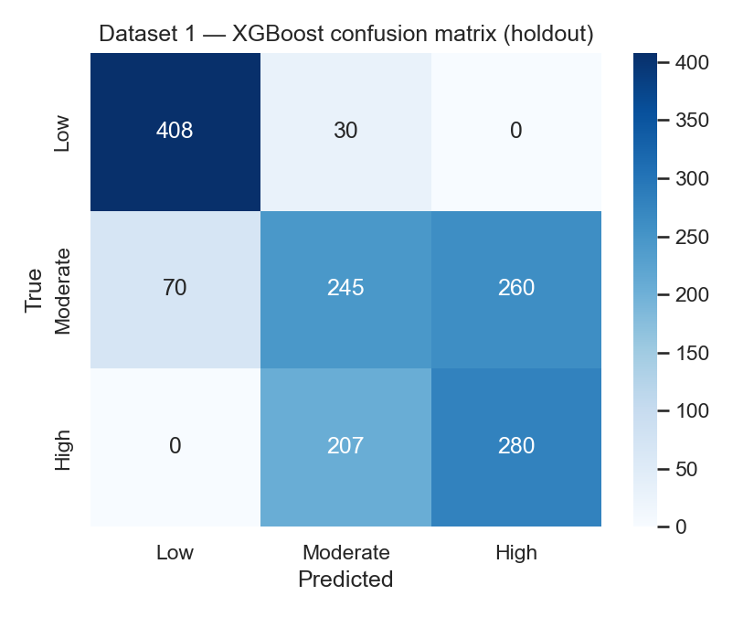
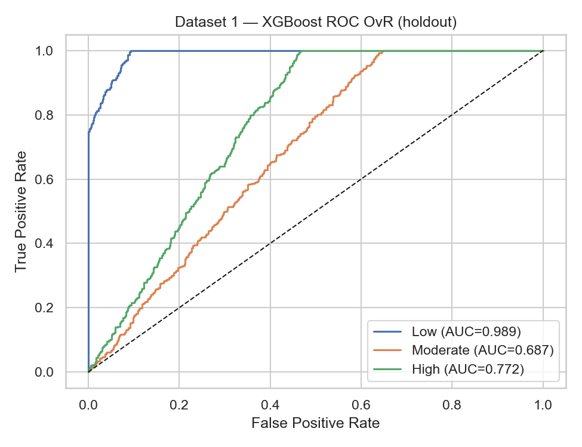
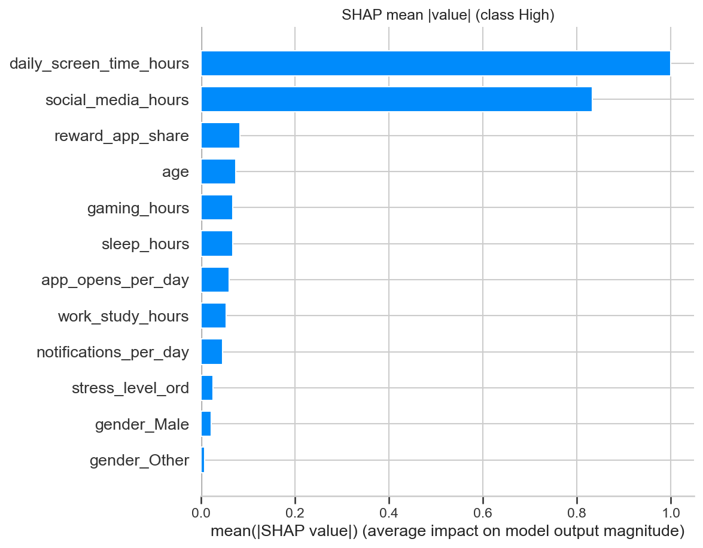
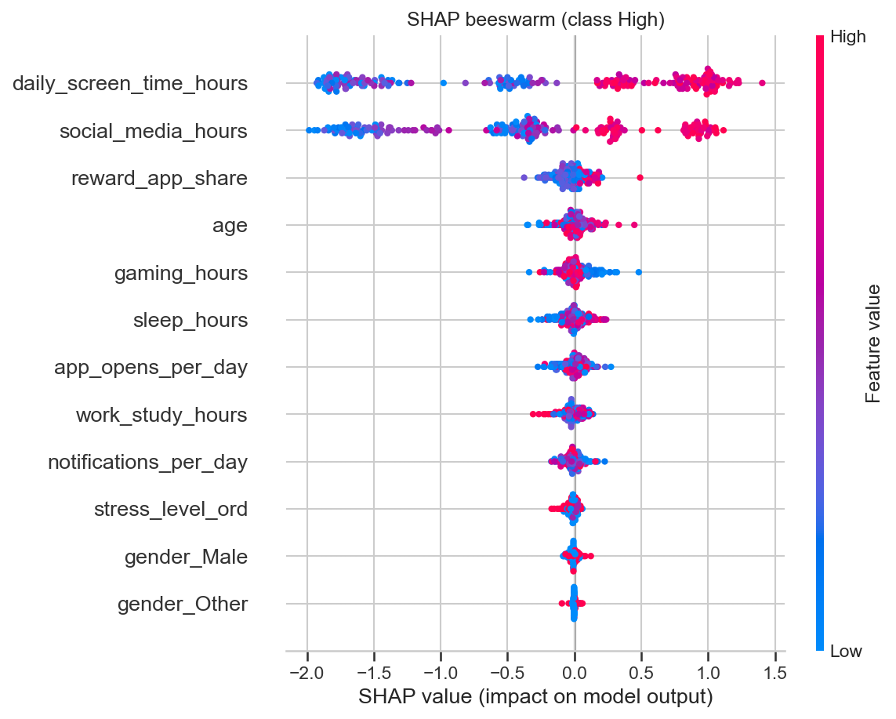
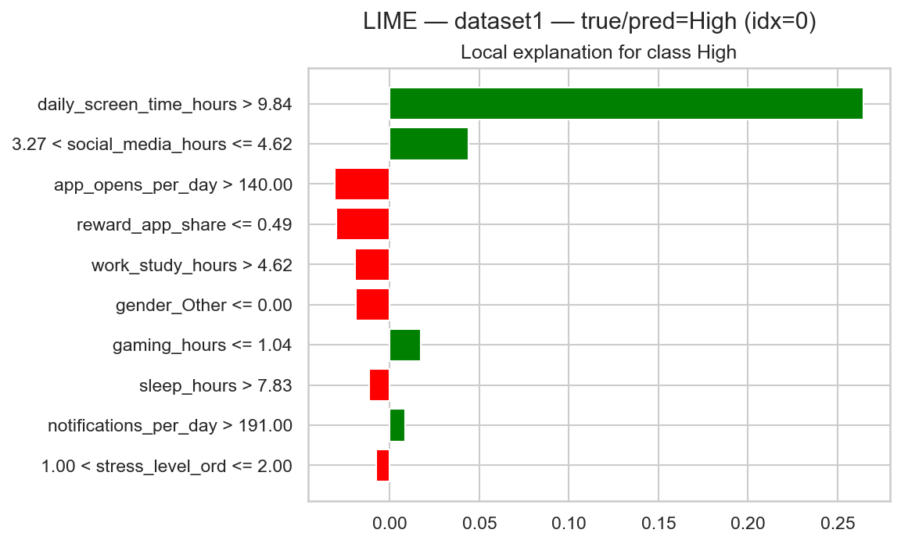
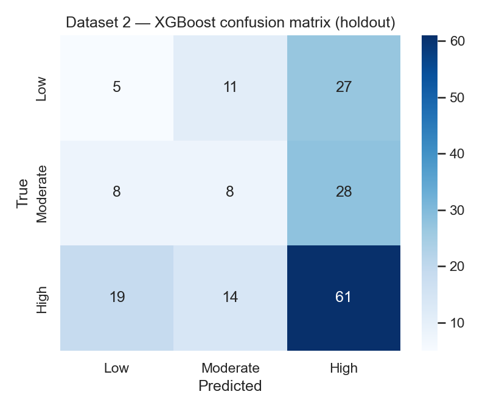

# Reward-Seeking Behaviour ML

Predict early **Low / Moderate / High** risk of problematic reward-seeking
smartphone habits in young adults, explain the top behavioural drivers, and
suggest practical digital well-being actions.

## Demo

Clone-and-run Streamlit app (no notebook retrain required if
`results/dataset1_best_model.joblib` is present).

```bash
pip install -r requirements.txt

# From the project root:
python -m streamlit run app/streamlit_app.py
```

Then open **http://localhost:8501**.

1. Enter a nickname and weekly usage averages  
2. Get risk level + class probabilities + top 3 SHAP drivers  
3. See 1–2 concrete actions mapped from those drivers  
4. Save the check-in and return later for a **risk trend**

Local check-ins are stored under `app/data/` (SQLite) and are **not** meant for
git. This tool is a digital well-being support demo — **not a clinical diagnosis**.

## Problem

Problematic smartphone use is often noticed only after sleep, focus, or study
are already hurt. High screen time alone is not the same as problematic
reward-seeking (notifications, social/gaming loops, app hopping).

We treat early risk as **3-class classification** (Low / Moderate / High) on
multidimensional usage and lifestyle features. Because classes can be uneven,
we prioritise **macro-F1** and **ROC-AUC (OvR)** alongside Accuracy.

The research trail is Jupyter notebooks with:

- leakage-aware cleaning and feature preparation on two public datasets
- **Logistic Regression**, **SVM**, **Random Forest**, **XGBoost**, and **MLP**
- nested cross-validation + train-only **SMOTE**
- **SHAP** (global / local drivers) and **LIME** (instance explanations)
- a Streamlit MVP that turns prediction into **actions + weekly trend**

## Project structure

```
reward-seeking-behavior-ml/
├── app/                     # Streamlit well-being check-in MVP
│   ├── streamlit_app.py     # UI: check-in, trend, about
│   ├── features.py          # Manual form → Dataset-1 feature vector
│   ├── inference.py         # Load joblib model; risk + top-3 SHAP
│   ├── interventions.py     # Driver → concrete action suggestions
│   ├── storage.py           # Local SQLite check-in history
│   └── data/                # Runtime DB (gitignored *.db)
├── src/                     # Shared modeling / nested-CV / XAI helpers
├── Data/
│   ├── *.csv                # Raw public datasets
│   └── processed/           # Prepared CSVs + feature dictionaries
├── notebooks/
│   ├── 01_data_understanding_and_preparation.ipynb
│   └── 02_model_development_evaluation_xai.ipynb
├── results/
│   ├── dataset*_best_model.joblib
│   ├── dataset*_metrics.json
│   ├── dataset*_model_comparison.csv
│   └── figures/             # Confusion, ROC, SHAP, LIME plots
├── requirements.txt
├── LICENSE
└── README.md
```

### Why each folder exists

| Path | Why it exists | If removed |
|------|---------------|------------|
| `app/` | Recruiter-facing Streamlit demo (risk → drivers → actions → trend) | No live product loop |
| `src/` | Nested CV, pipelines, metrics, SHAP/LIME helpers used by notebook 02 | Harder to reproduce training cleanly |
| `Data/` | Raw CSVs for notebooks | Nothing to load for research trail |
| `Data/processed/` | Leakage-aware prepared tables + schemas for modeling | Notebook 02 / scoring assumptions break |
| `notebooks/` | Academic trail: prep → models → evaluation → XAI | No research narrative |
| `results/` | Trained models, metrics, and figures for report + demo | App cannot score without retraining |
| `requirements.txt` | Single dependency list for research + Streamlit | Setup is unclear |

## Setup

### Pip

```bash
python -m venv .venv
# Windows:
.venv\Scripts\activate

pip install -r requirements.txt
```

### Datasets

| Dataset | File | Notes |
|---------|------|--------|
| Dataset 1 (primary / app) | `Data/Smartphone_Usage_And_Addiction_Analysis_7500_Rows.csv` | N = 7,500; ages 18–35 |
| Dataset 2 (secondary) | `Data/mobile_addiction_data.csv` | Filtered to ages 18–35 → N = 904 prepared |

Prepared outputs live in `Data/processed/` (created by notebook 01). The Streamlit
demo scores with the **Dataset 1 XGBoost** bundle in `results/`.

## Notebooks

Open Jupyter from the project folder and run notebooks **in order**:

| # | Notebook | Purpose |
|---|----------|---------|
| 01 | `01_data_understanding_and_preparation.ipynb` | Inspect both datasets, EDA, cleaning, feature selection/engineering, save prepared CSVs |
| 02 | `02_model_development_evaluation_xai.ipynb` | Stratified split, nested CV, model comparison, holdout metrics, SHAP + LIME, save artefacts |

Shared training helpers: `src/modeling_core.py`.

## Observed results (seed = 42, this machine)

### Dataset 1 (primary — used by the app)

| Stage | Result |
|-------|--------|
| Task | 3-class risk: Low / Moderate / High |
| Best model | **XGBoost** |
| Nested CV macro-F1 | 0.631 ± 0.009 |
| Nested CV ROC-AUC (OvR macro) | 0.815 ± 0.004 |
| Holdout macro-F1 | 0.633 |
| Holdout ROC-AUC | 0.816 |
| Baselines | RF close behind; LR / MLP / SVM lower |

### Dataset 2 (secondary — research stress test)

| Stage | Result |
|-------|--------|
| Prepared N (ages 18–35) | 904 |
| Best nested macro-F1 | ~0.33 (near chance) |
| Holdout ROC-AUC | ~0.52 |

Dataset 2 is reported honestly as a **negative / boundary** result: small sample +
self-report labels limit discrimination. It is **not** behind the Streamlit app.

Exact numbers can vary slightly by hardware; re-run notebooks for your machine.

## Findings

<table>
  <tr>
    <td width="50%" valign="top">
      <br>
      <b>1. XGBoost is the strongest primary model.</b> Holdout macro-F1 ≈ 0.63 with balanced three-way risk prediction—not perfect, but usable for triage.
    </td>
    <td width="50%" valign="top">
      <br>
      <b>2. Ranking quality is stronger than hard accuracy.</b> ROC-AUC ≈ 0.82 supports ordering users by early risk even when class boundaries are fuzzy.
    </td>
  </tr>
  <tr>
    <td width="50%" valign="top">
      <br>
      <b>3. High risk is multi-signal, not screen time alone.</b> SHAP highlights combinations of usage intensity, notifications/app opens, sleep, and stress.
    </td>
    <td width="50%" valign="top">
      <br>
      <b>4. Explanations make the model usable.</b> Global SHAP (and LIME in the notebook) answer which behaviours push a person toward High risk.
    </td>
  </tr>
  <tr>
    <td width="50%" valign="top">
      <br>
      <b>5. Local explanations support coaching.</b> LIME shows instance-level reasons—useful for “what should I change this week?”
    </td>
    <td width="50%" valign="top">
      <br>
      <b>6. Weak labels + small N break the same protocol.</b> On Dataset 2, performance collapses near chance—architecture cannot fix a weak phenotype–label link.
    </td>
  </tr>
</table>

## How the Streamlit loop works

```text
Manual weekly stats
   → feature builder (same schema as Dataset 1 training)
   → XGBoost risk + probabilities
   → top 3 SHAP drivers
   → 1–2 rule-based actions
   → optional save → risk trend over check-ins
```

| Piece | Implementation |
|-------|----------------|
| Risk class | Trained XGBoost pipeline (`results/dataset1_best_model.joblib`) |
| Top drivers | TreeSHAP on the predicted class |
| Actions | Rule map in `app/interventions.py` (not another ML model) |
| Trend | Local SQLite history in `app/storage.py` |

## Models compared

- **Logistic Regression** — linear baseline (scaled + SMOTE)
- **RBF-SVM** — non-linear margin baseline
- **Random Forest** — bagged trees
- **XGBoost** — gradient boosting (**winner** on Dataset 1)
- **MLP** — shallow neural net baseline

Training uses stratified 80/20 holdout, nested 5×5 RandomizedSearch (macro-F1),
and **SMOTE inside the training pipeline only**.

## License

See [LICENSE](LICENSE).
